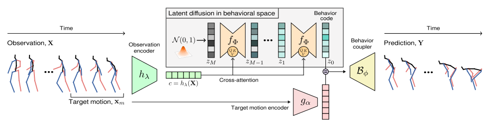

# BeLFusion
### Latent Diffusion for Behavior-Driven Human Motion Prediction
<br>



This repository **will soon be updated** with the code for our paper:

**BeLFusion: Latent Diffusion for Behavior-Driven Human Motion Prediction**<br>
*German Barquero, Sergio Escalera, and Cristina Palmero*<br>
[[website](https://barquerogerman.github.io/BeLFusion/)] [[paper](https://arxiv.org/abs/2211.14304)] [[demo](https://barquerogerman.github.io/BeLFusion/)]

## Citation
If you find our work useful in your research, please consider citing our paper:
```
@article{barquero2022belfusion,
  title={BeLFusion: Latent Diffusion for Behavior-Driven Human Motion Prediction},
  author={Barquero, German and Escalera, Sergio and Palmero, Cristina},
  journal={arXiv preprint arXiv:2211.14304},
  year={2022}
}
```

## License
The software in this repository is freely available for free non-commercial use (see [license](https://github.com/BarqueroGerman/BeLFusion/blob/main/LICENSE) for further details).
